## UI设计

我们参照美团外卖建立UI界面

### 主界面：

商家介绍、点菜评价商家选择栏、菜品类型、菜列表、购物车、结算按钮

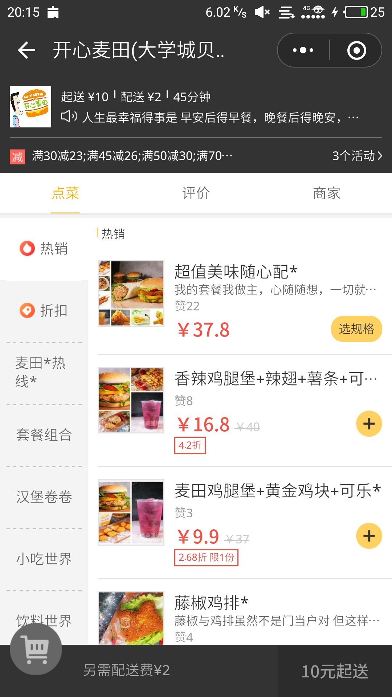

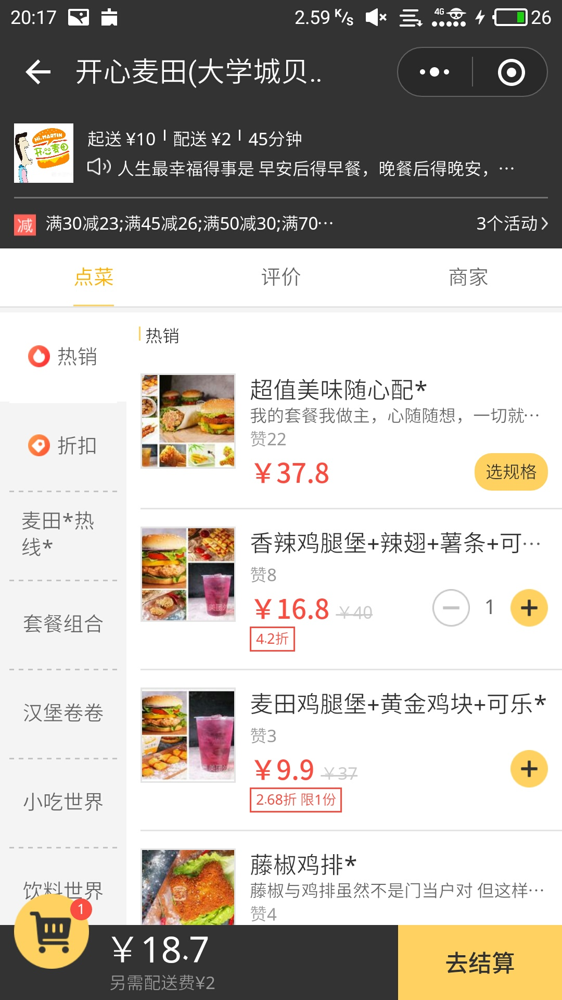

### 商家介绍

在主界面直接点击商家信息（屏幕最上方）

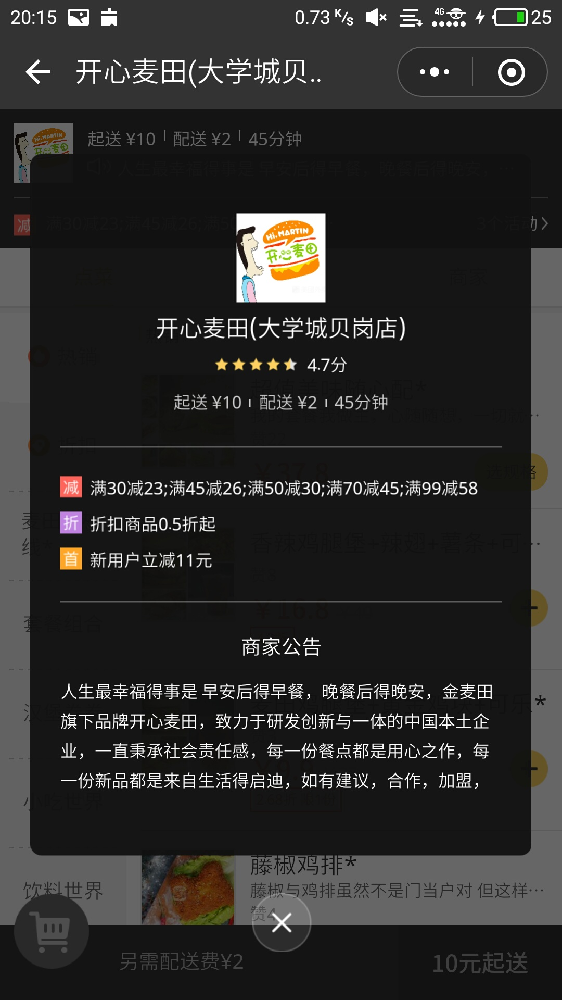

点击点菜评价商家选择栏里边的商家

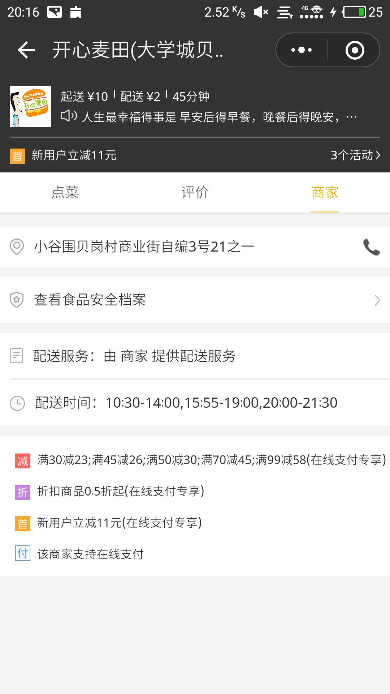

### 菜详细信息

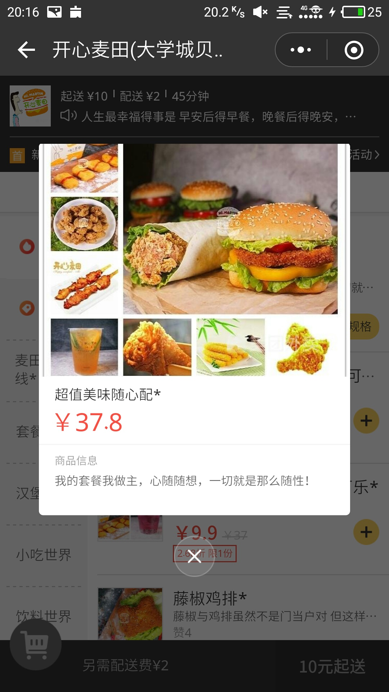

### 购物车界面

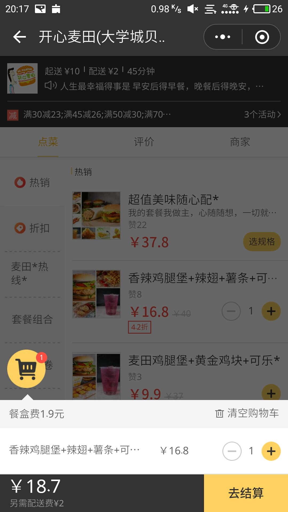

### 结算界面：

订单详情、备注

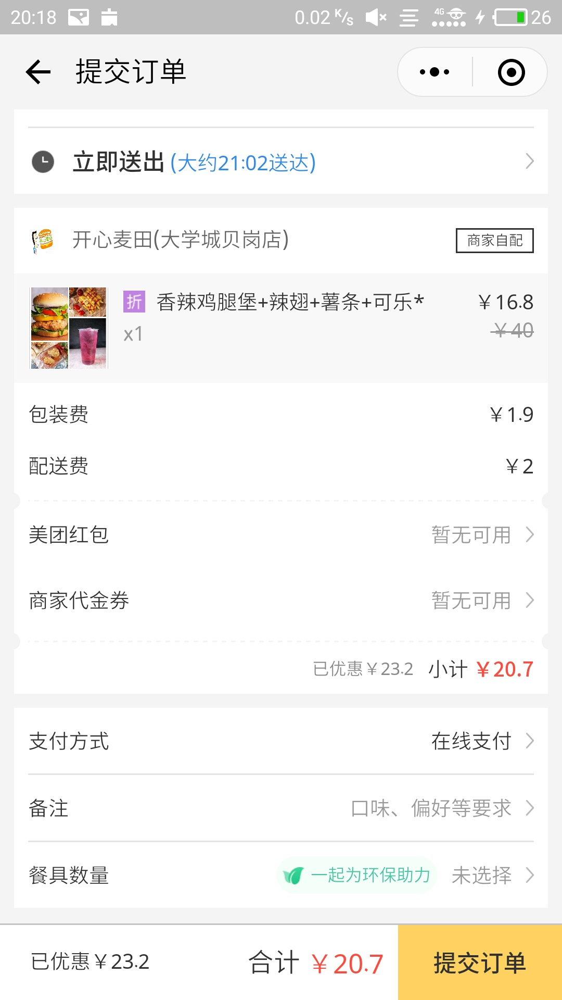

### 备注界面

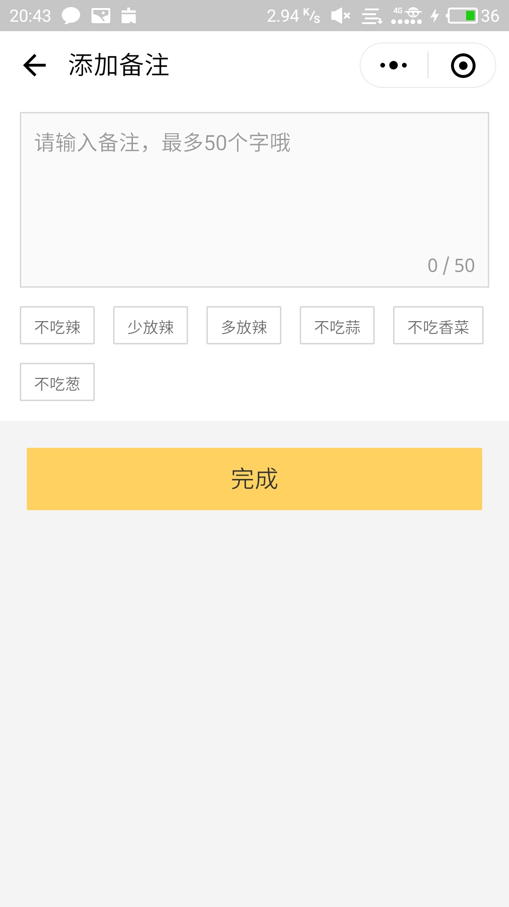

### 支付界面

支付方式选择

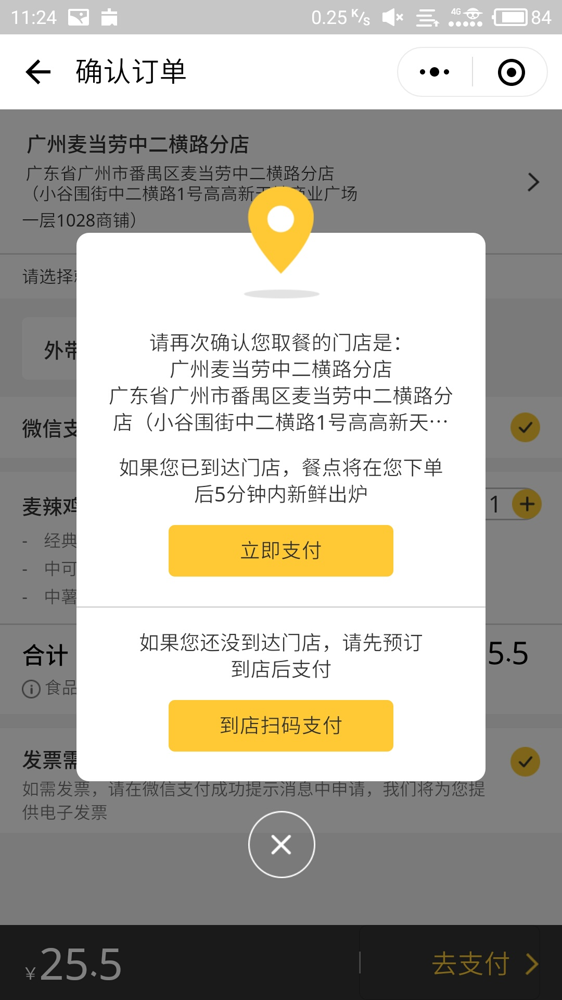

### 支付成功界面

支付成功后应含有历史点餐记录且能跳转评价页面

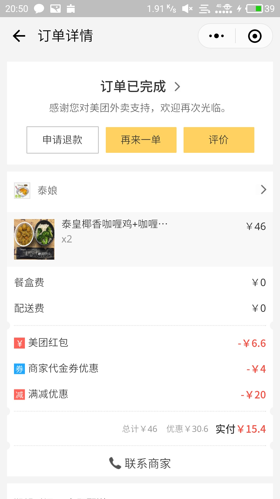

### 评价界面：

查看评价

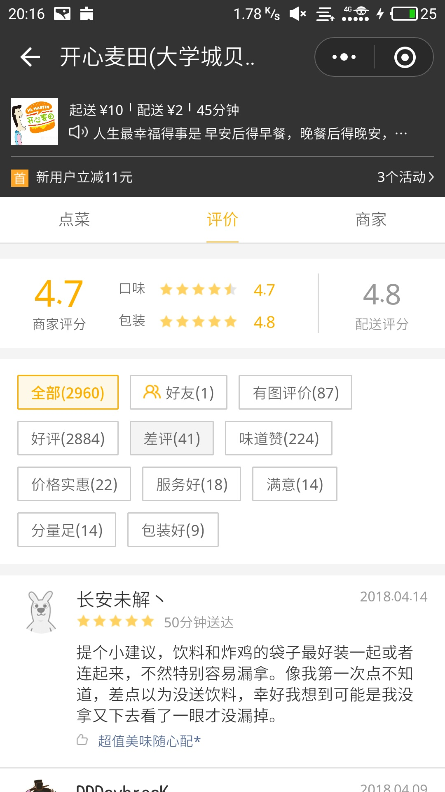

添加评价

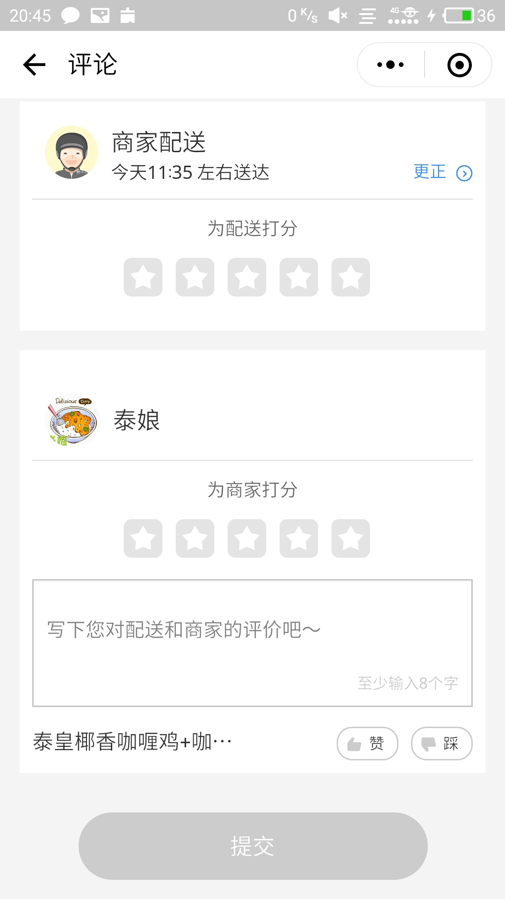